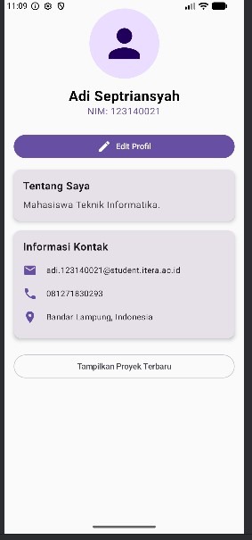
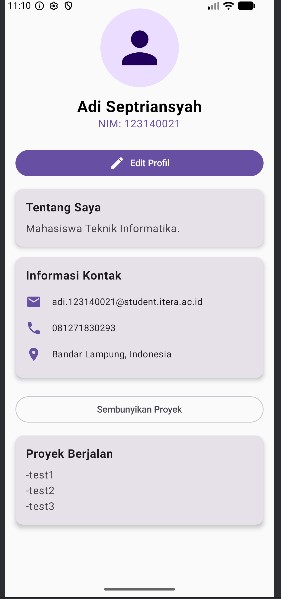
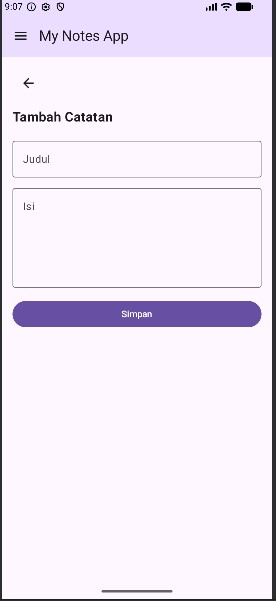
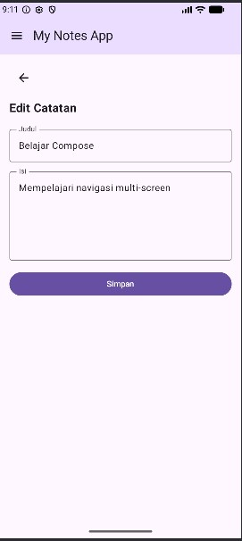
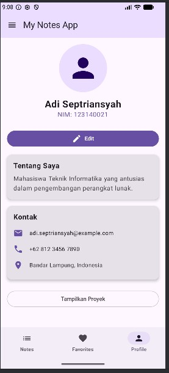
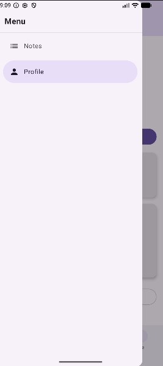

# Tugas Praktikum 5: Navigation & Multi-Screen App

## Identitas Mahasiswa
* **Nama:** Adi Septriansyah
* **NIM:** 123140021
* **Mata Kuliah:** Pengembangan Aplikasi Mobile (IF25-22017)

---

## Struktur Folder
* `data/` : Berisi model struktur data (`Note`) dan *dummy data*.
* `navigation/` : Berisi `Sealed Class` untuk mendefinisikan seluruh rute (*routes*).
* `components/` : Berisi potongan UI seperti `ProfileSectionCard` dan `ProfileHeader`.
* `screens/` : Berisi *Composable function* yang mewakili satu halaman penuh (misal: `NotesListScreen`, `ProfileScreen`, `NoteDetailScreen`).

---

## Screenshots & Demo

* **Tab Notes & FAB**:

  

* **Note Detail**:

  

* **Add Note**:

  

* **Edit Note**:

  

* **Tab Profile**:

  

* **Navigation Drawer**:

  

---

## Video Demonstrasi

https://github.com/user-attachments/assets/bd76f377-c8f5-4839-8f36-537c98400e3d

